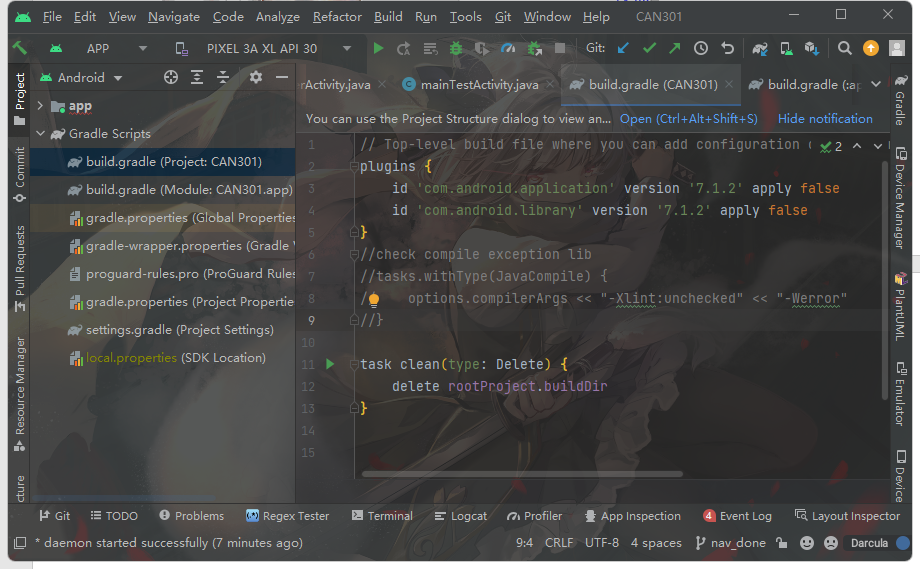
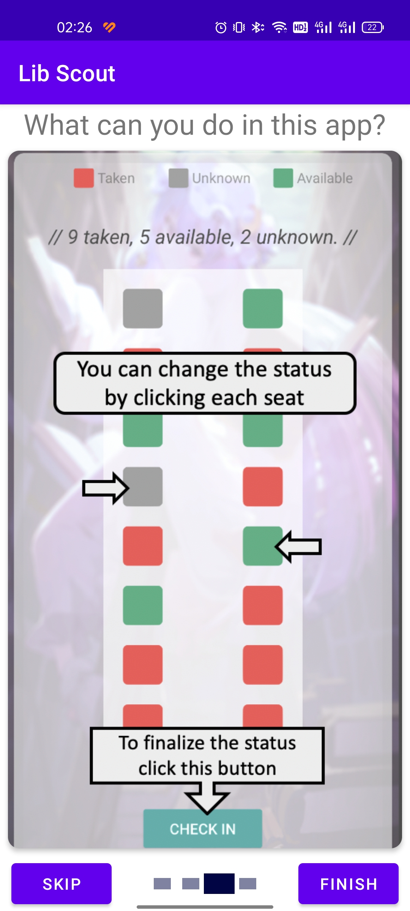
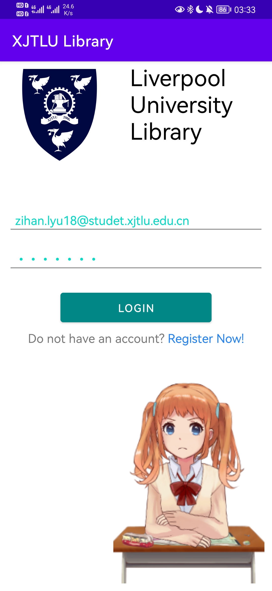
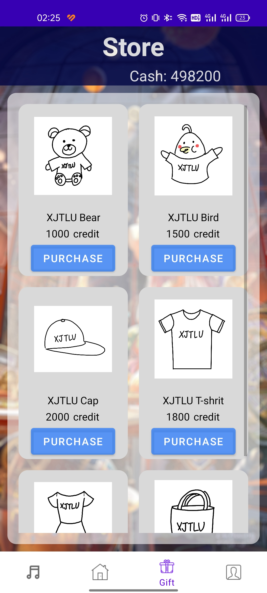
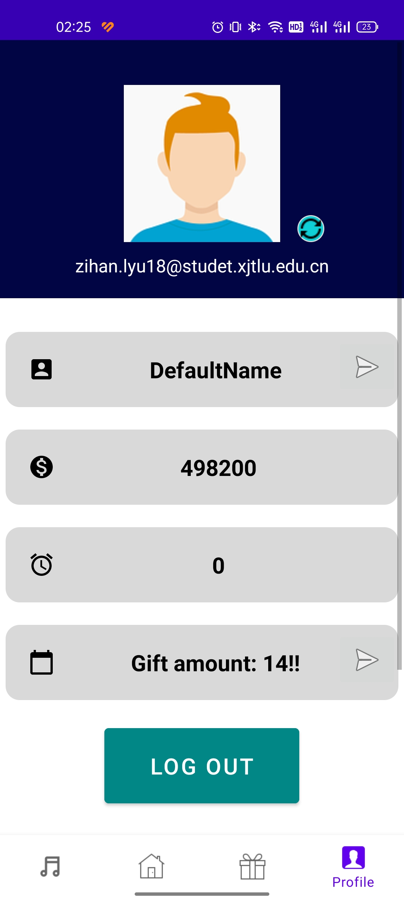
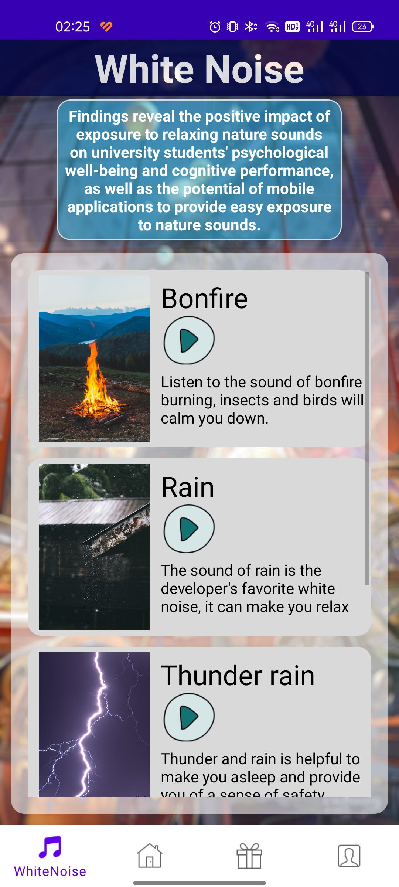
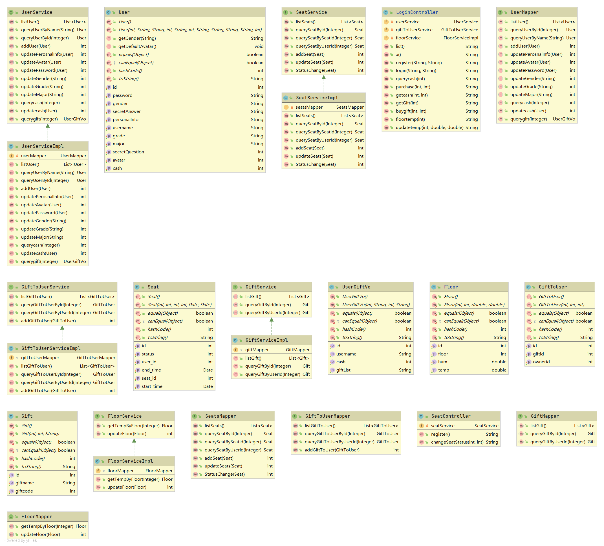
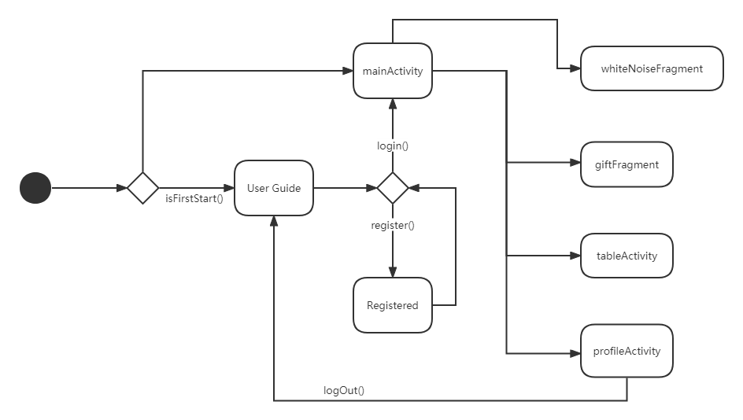

# CAN301

## Deployment Instruction

- The project is based on Android SDK 32 which is supported on any device with SDK higher than 21.

- To access our source code and Git repository you may access these links below:

-  Frontend

  -  https://github.com/Rathgrith/CAN301.git

- Backend

  - https://github.com/Stellariser/can301backend.git

    

-   Cloning the project using Android Studio could automatically build a release version based on current codes on repository after synchronizing gradle dependencies. It should be like this:

​                                

- If you need to do deployment debugging, try launching the project directly: 
  - If you wish to run the back-end part of this project,  you need to adjust the configuration of the linked database in src/main/resources/application.yml

## Project Demo

### Tutorial Page 

### Login Page

### Main Functions

## UML Diagrams

### Frontend Class Diagram 

### Backend Class Diagram

### User Activity Diagram

